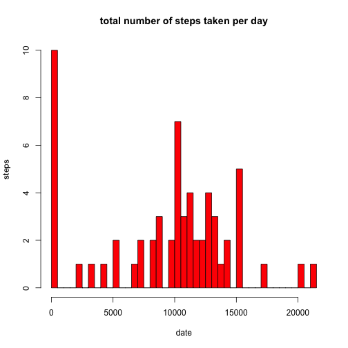
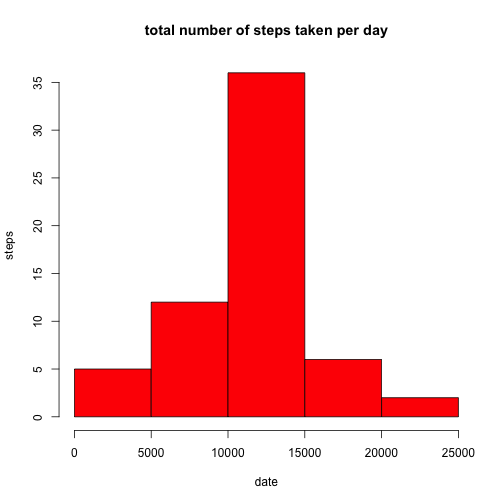

# Reproducible Research: Peer Assessment 1


## Loading and preprocessing the data

Loads the activities data into `act.df` and do the preprocessing  

* Load the data  

```r
act.df <- read.csv("activity.csv")
```

* Process/transform the data (if necessary) into a format suitable 
for your analysis  

```r
act.df$date <- as.Date(act.df$date, "%Y-%m-%d")
```


## What is mean total number of steps taken per day?
For this part of the assignment, we ignore the missing values in the dataset.  

* Make a histogram of the total number of steps taken each day  

```r
date.split <- split(act.df, act.df$date)
total.steps <- lapply(date.split, function(x) sum(x[, "steps"], na.rm=TRUE))
total.steps <- unlist(total.steps)
hist(total.steps, freq=TRUE, xlab="date", ylab="steps",
     main="total number of steps taken per day",
     col="red")
```

 

* Calculate and report the mean and median total number of steps taken per day

```r
mean.steps <- mean(as.numeric(total.steps))
mean.steps
```

```
## [1] 9354
```

```r
median.steps <- median(as.numeric(total.steps))
median.steps
```

```
## [1] 10395
```

## What is the average daily activity pattern?
1. Make a time series plot (i.e. type = "l") of the 5-minute interval (x-axis) 
and the average number of steps taken, averaged across all days (y-axis)  

```r
interval.split <- split(act.df, act.df$interval)
mean.steps <- lapply(interval.split, function(x) mean(x[, "steps"], na.rm=TRUE))
mean.steps <- unlist(mean.steps)
plot(names(mean.steps), mean.steps, type="l", xlab="interval", ylab="steps",
     main="average number of steps taken, averaged across all days, 
     with interval")
```

 

2. Which 5-minute interval, on average across all the days in the dataset, 
contains the maximum number of steps?  

```r
max.interval <- names(which(mean.steps == max(mean.steps)))
max.interval
```

```
## [1] "835"
```


## Inputing missing values
Note that there are a number of days/intervals where there are missing values 
(coded as NA). The presence of missing days may introduce bias into some 
calculations or summaries of the data.  

1. Calculate and report the total number of missing values in the dataset 
(i.e. the total number of rows with NAs)  

```r
length(which(is.na(act.df$steps)))
```

```
## [1] 2304
```

2. Devise a strategy for filling in all of the missing values in the dataset. 
The strategy does not need to be sophisticated. For example, you could use the 
mean/median for that day, or the mean for that 5-minute interval, etc.  

* Use mean for that 5-minute interval to substitute `NA` value


```r
mean.steps <- lapply(interval.split, function(x) mean(x[, "steps"], na.rm=TRUE))
```

3. Create a new dataset that is equal to the original dataset but with the 
missing data filled in.  

```r
act.df.noNA <- act.df
for (i in 1:nrow(act.df.noNA)) {
    if (is.na(act.df.noNA[i, "steps"])) {
        act.df.noNA[i, "steps"] <- mean.steps[ as.character(act.df.noNA[i, "interval"]) ]
    }
}
```

4. Make a histogram of the total number of steps taken each day and Calculate 
and report the mean and median total number of steps taken per day. Do these 
values differ from the estimates from the first part of the assignment? What is 
the impact of inputing missing data on the estimates of the total daily number 
of steps?  

* After inputing missing data, mean and median total number of steps taken per 
day will definitely increase if we don't ignore them.  


```r
date.split <- split(act.df.noNA, act.df.noNA$date)
total.steps <- lapply(date.split, function(x) sum(x[, "steps"], na.rm=TRUE))
total.steps <- unlist(total.steps)
hist(total.steps, freq=TRUE, xlab="date", ylab="steps",
     main="total number of steps taken per day",
     col="red")
```

 

```r
mean.steps <- mean(as.numeric(total.steps))
mean.steps
```

```
## [1] 10766
```

```r
median.steps <- median(as.numeric(total.steps))
median.steps
```

```
## [1] 10766
```


## Are there differences in activity patterns between weekdays and weekends?
For this part the weekdays() function may be of some help here. Use the dataset 
with the filled-in missing values for this part.

1. Create a new factor variable in the dataset with two levels – “weekday” and 
“weekend” indicating whether a given date is a weekday or weekend day.  

```r
act.df.weekdays <- weekdays(act.df.noNA[,"date"])
act.df.weekdays <- unlist(lapply(act.df.weekdays, function(x) {
        if ( (x == "Saturday") || (x == "Sunday") ) {
            "weekend"
        } else {
            "weekday"
        }
    }
))
act.df.weekdays <- factor(act.df.weekdays)
```

2. Make a panel plot containing a time series plot (i.e. type = "l") of the 
5-minute interval (x-axis) and the average number of steps taken, averaged 
across all weekday days or weekend days (y-axis).

```r
act.df.noNA$weekday <- act.df.weekdays
par(mfrow = c(2, 1), mar = c(4, 4, 2, 1))

act.df.noNA.weekday <- act.df.noNA[which(act.df.noNA$weekday == "weekday"),]
weekday.interval.split <- split(act.df.noNA.weekday, act.df.noNA.weekday$interval)
mean.steps <- lapply(weekday.interval.split, function(x) mean(x[, "steps"], na.rm=TRUE))
mean.steps <- unlist(mean.steps)
plot(names(mean.steps), mean.steps, type="l", xlab="interval", ylab="steps",
     main="weekday")

act.df.noNA.weekend <- act.df.noNA[which(act.df.noNA$weekday == "weekend"),]
weekend.interval.split <- split(act.df.noNA.weekend, act.df.noNA.weekend$interval)
mean.steps <- lapply(weekend.interval.split, function(x) mean(x[, "steps"], na.rm=TRUE))
mean.steps <- unlist(mean.steps)
plot(names(mean.steps), mean.steps, type="l", xlab="interval", ylab="steps",
     main="weekday")
```

 
