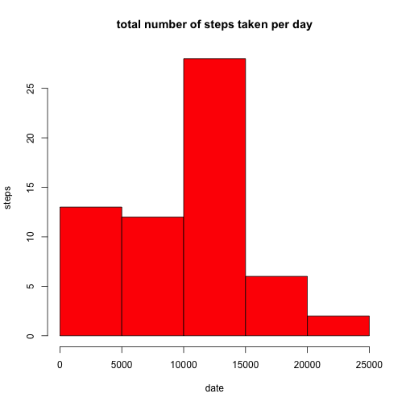

# Reproducible Research: Peer Assessment 1


## Loading and preprocessing the data

Loads the activities data into `act.df` and do the preprocessing  

1. Load the data  

```r
act.df <- read.csv("activity.csv")
```

2. Process/transform the data (if necessary) into a format suitable 
for your analysis  

```r
act.df$date <- as.Date(act.df$date, "%Y-%m-%d")
```


## What is mean total number of steps taken per day?
For this part of the assignment, we ignore the missing values in the dataset.  

1. Make a histogram of the total number of steps taken each day  

```r
date.split <- split(act.df, act.df$date)
total.steps <- lapply(date.split, function(x) sum(x[, "steps"], na.rm=TRUE))
total.steps <- unlist(total.steps)
hist(as.numeric(total.steps), breaks=length(total.steps), freq=TRUE, xlab="date", ylab="steps",
     main="total number of steps taken per day",
     col="red")
```

 

2. Calculate and report the mean and median total number of steps taken per day

```r
mean.steps <- mean(as.numeric(total.steps))
mean.steps
```

```
## [1] 9354
```

```r
median.steps <- median(as.numeric(total.steps))
median.steps
```

```
## [1] 10395
```

## What is the average daily activity pattern?


## Imputing missing values


## Are there differences in activity patterns between weekdays and weekends?
